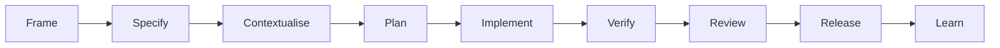

# Lloyd Ntim Portfolio

This is my multilingual professional portfolio, built as a production-quality Next.js application and as a practical demonstration of specification-driven, AI-assisted software delivery.

It presents my experience across product engineering, full-stack engineering, software architecture, and agentic engineering. I also use this repository to document how I integrate AI coding tools into a controlled developer workflow with explicit specifications, bounded authority, human approval, automated quality checks, and independent review.

## Project status

The first release is complete. It includes the approved architecture, English, German, and French content, case studies, contact delivery, automated tests, and Netlify deployment configuration. I will continue to expand and refine the portfolio over time.

## What this repository demonstrates

| Area | Evidence |
| --- | --- |
| AI-driven developer workflow | I use Claude Code as my primary implementation harness and Codex for independent review while retaining responsibility for product, architecture, security, and release decisions. |
| Specification-driven delivery | I connect requirements to implementation through repository rules, an approved architecture, acceptance-oriented tests, decision records, and a reusable nine-stage workflow. |
| Cross-team platform design | My Vorwerk case study covers React SSR integrated with Java, AEM, GitLab CI/CD, and AWS Lambda while preserving CMS editor workflows. |
| Full-stack product engineering | My work on VocApp combines Next.js, Node.js, Express, PostgreSQL, Redis, Google Cloud services, Docker, GitHub Actions, and Sentry. |
| Multi-platform integration | My work on Guilds uses a shared React Native component model across mobile and web while integrating with FastAPI and PostgreSQL. |
| Production quality | I use type checking, linting, unit and component tests, end-to-end tests, accessibility scans, visual regression tests, responsive behaviour, and error handling. |

## Agentic engineering workflow

I use AI as an engineering tool within a delivery process that I own and direct. It supports the work without replacing my judgement or accountability.



My operating model includes:

- Defining scope, constraints, and acceptance criteria before material implementation.
- Providing task-specific context and setting explicit limits on agent authority.
- Keeping changes small and reviewable, with appropriate tests and documentation.
- Using Claude Code for primary implementation work.
- Using Codex as a separate review context for architecture and pull requests.
- Retaining approval over architecture, public content, risky dependencies, pushes, merges, and production deployment.
- Requiring evidence of completion through builds, tests, browser checks, screenshots, and review findings.
- Capturing reusable learning in repository instructions and technical documentation.

See the complete [Agentic Engineering workflow](specs/workflows/agentic-engineering-workflow.md) and the [Netlify Forms worked example](docs/agentic-engineering-worked-example.md).

### How AI supports the work

I use Claude Code, Codex, and Copilot as development-time coding tools. They support specification, implementation, verification, review, and documentation while I remain responsible for the decisions and the finished work.

The portfolio itself is a Next.js application. The agentic engineering element is the delivery workflow I have designed and documented around it.

## Architecture

I designed the application around a static-first Next.js App Router architecture for Netlify's managed Next.js runtime.

```text
src/
  app/                  Locale-aware routes, metadata, errors, sitemap, and robots
  content/              English, German, and French site and case-study content
  features/
    home/               Homepage sections, contact workflow, and validation
    caseStudies/        Case-study presentation, schemas, and data-access boundary
  i18n/                 Locale routing and navigation
  shared/               Reusable UI, layout, hooks, helpers, and types
specs/
  architecture/         Approved application architecture and decision records
  workflows/            Reusable AI-assisted engineering workflow
tests/
  accessibility/        Automated axe-core checks
  e2e/                  Critical user journeys
  visual/               Playwright screenshot regression checks
reference/prototype/     Read-only visual reference
```

### Important design decisions

- **Static-first rendering:** public pages are primarily pre-rendered and served through a CDN.
- **Replaceable content source:** presentation components consume validated case-study data through a boundary that can later switch from local JSON to headless WordPress.
- **Replaceable contact delivery:** the form depends on a local delivery abstraction rather than importing Netlify-specific behavior directly.
- **Runtime validation:** Zod validates content and form data at application boundaries.
- **Localization:** `next-intl` provides locale-aware routing for English, German, and French.
- **Accessible interaction:** the project targets WCAG 2.2 AA and includes reduced-motion behavior, semantic structure, keyboard support, and automated accessibility checks.
- **Visual confidence:** Playwright screenshot baselines protect the approved visual direction across desktop and mobile layouts.

The full reasoning, alternatives, consequences, and status of each decision are recorded in the [application architecture](specs/architecture/application-architecture.md).

## Selected case studies

### VocApp

I built this mobile-first, API-backed language-learning product end to end for AnzaKen. The project demonstrates my work across full-stack architecture, secure API access, cloud translation and text-to-speech integration, CI/CD, observability, and AI-assisted engineering practices.

### Vorwerk

I designed a frontend platform architecture for this multi-market website. I integrated React server-side rendering with Java servlets and AEM while preserving WYSIWYG authoring for CMS editors, with GitLab CI/CD deployment to AWS Lambda. This is my strongest example here of cross-team platform and integration design.

### Guilds

I worked on this mobile gaming wallet across React Native, React Native Web, FastAPI, and PostgreSQL. My work included a shared component model, API and data integration, and collaboration across product, design, frontend, backend, and technical leadership.

## Technology

- TypeScript
- Next.js 16 and React 19
- Next.js App Router and React Server Components
- Tailwind CSS 4
- next-intl
- Zod
- Vitest and React Testing Library
- Playwright and axe-core
- Netlify Forms and Netlify's managed Next.js runtime
- pnpm

## Quality checks

I use the following repository checks:

| Command | Purpose |
| --- | --- |
| `pnpm typecheck` | Validate TypeScript without emitting files |
| `pnpm lint` | Run ESLint |
| `pnpm test` | Run unit and component tests |
| `pnpm test:e2e` | Run critical browser journeys |
| `pnpm test:a11y` | Run automated accessibility scans |
| `pnpm test:visual` | Compare desktop and mobile screenshots |
| `pnpm build` | Produce the production build |

I use automated checks to support, rather than replace, manual keyboard, responsive, content, and visual review.

## Run locally

### Prerequisites

- Node.js 24
- pnpm 11.21.0

### Setup

```bash
pnpm install
pnpm dev
```

Open `http://localhost:3000`. Locale-aware routes are available under `/en`, `/de`, and `/fr` when included in the published locale configuration.

For a production build:

```bash
pnpm build
pnpm start
```

## Documentation map

- [`AGENTS.md`](AGENTS.md): repository rules, approval boundaries, quality standards, and delivery expectations.
- [`CLAUDE.md`](CLAUDE.md): concise Claude Code entry point.
- [`specs/workflows/agentic-engineering-workflow.md`](specs/workflows/agentic-engineering-workflow.md): reusable AI-assisted delivery process.
- [`docs/agentic-engineering-worked-example.md`](docs/agentic-engineering-worked-example.md): evidence-backed example connecting a production integration issue to a reviewed change.
- [`specs/architecture/application-architecture.md`](specs/architecture/application-architecture.md): application structure, integration boundaries, tradeoffs, and architecture decision records.
- [`specs/prototype-analysis.md`](specs/prototype-analysis.md): analysis of the visual prototype and responsive behavior.
- [`specs/content/agentic-engineering-public-copy.md`](specs/content/agentic-engineering-public-copy.md): ideas for extending the public workflow copy in a future release.

## AI assistance and accountability

I record AI assistance in the repository history through commit co-author trailers where appropriate. I own the requirements, approve architecture and public claims, review the output, and control every push, merge, and production release.

My goal is not to maximise generated code. I use AI to improve delivery speed while keeping decisions, evidence, and accountability visible.
